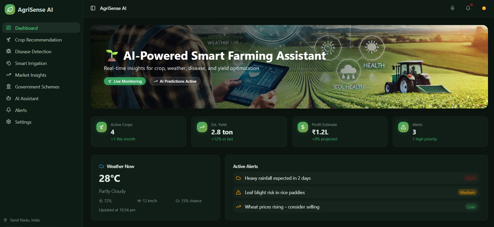
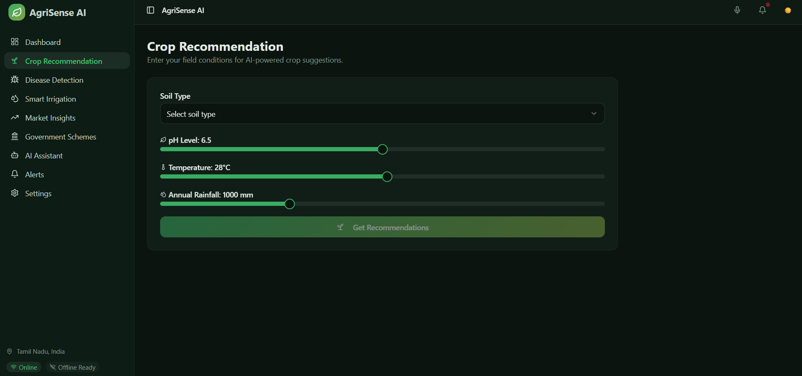
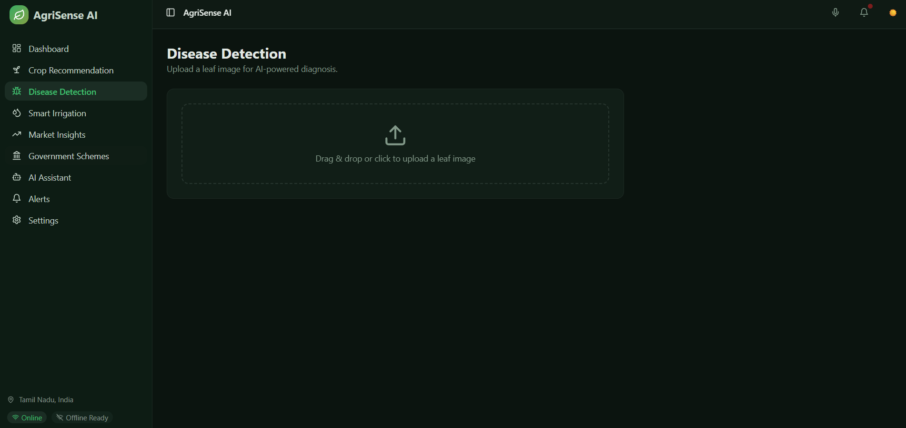
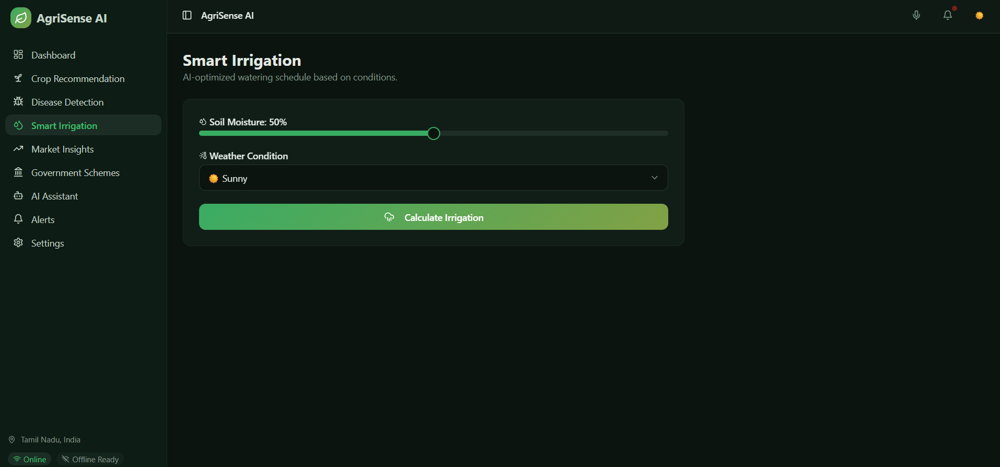
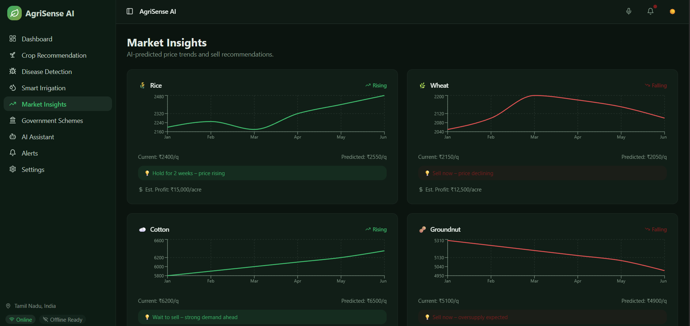
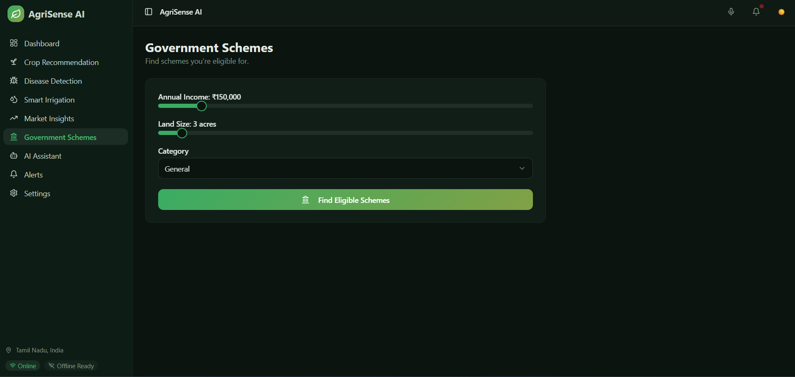
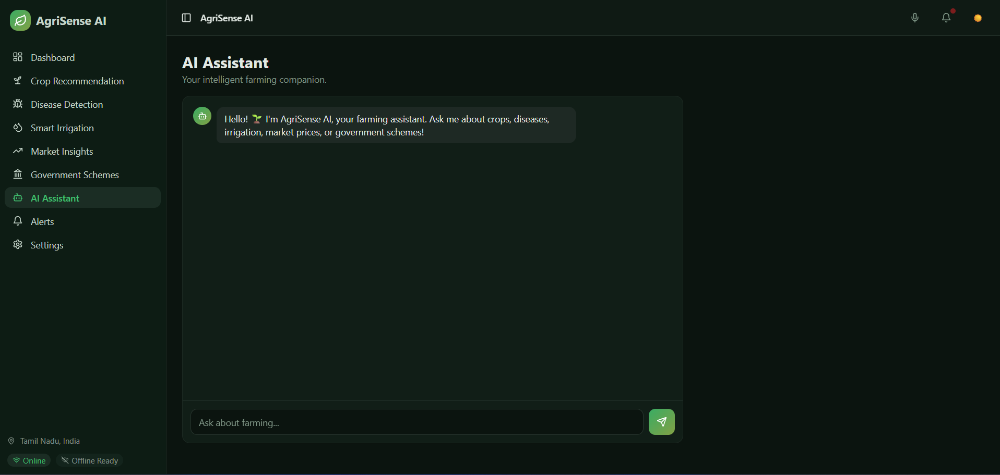
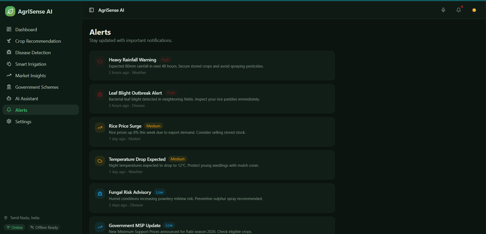
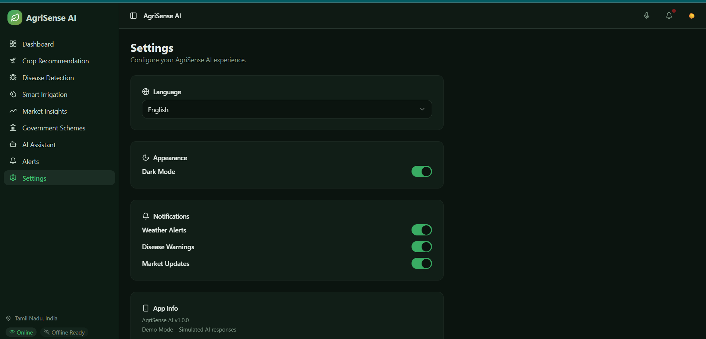

# 🚜 AgriSense AI – Smart Farming Assistant

🌱 **AI-powered agriculture companion for real-time decision making**

---

## 🌐 Live Demo  
🚀 Try the project here: 👉 https://agri-sense-ai-smart-farming-assista.vercel.app

---

## 📌 Project Status

⚠️ **This is a DEMO / PROTOTYPE project**

* Current version showcases **UI + simulated AI responses**
* Core ML models and backend integrations are **planned for future implementation**
* Designed to demonstrate **real-world problem-solving approach + system design**

---

## 📌 Problem Statement

Farmers face multiple real-world challenges:

* ❌ No proper crop selection guidance
* ❌ Late detection of plant diseases
* ❌ Water wastage due to poor irrigation planning
* ❌ Lack of market price insights
* ❌ Difficulty accessing government schemes
* ❌ Language barriers in digital tools

👉 **Solution:**
AgriSense AI provides an **all-in-one intelligent platform** that helps farmers make better decisions using AI-driven insights.

---

## 🚀 Features

### 🌾 Crop Recommendation

* Suggests crops based on:

  * Soil type
  * pH level
  * Temperature
  * Rainfall

---

### 🦠 Disease Detection

* Upload leaf image
* AI-based disease prediction *(demo logic)*
* Treatment suggestions

---

### 💧 Smart Irrigation

* Calculates watering needs
* Based on soil moisture & weather

---

### 📊 Market Insights

* Predicts price trends
* Suggests sell/hold decisions

---

### 🏛 Government Schemes

* Finds schemes based on:

  * Income
  * Land size
  * Category

---

### 🤖 AI Assistant

* Chat-based farming assistant
* Answers queries on:

  * Crops
  * Diseases
  * Market

---

### 🔔 Alerts System

* Weather alerts 🌧
* Disease alerts 🦠
* Market alerts 📉

---

### ⚙️ Settings

* Dark mode 🌙
* Notification control
* Language support *(demo only)*

---

## 🖼️ UI Screenshots

### 🏠 Dashboard

---

### 🌾 Crop Recommendation

---

### 🦠 Disease Detection

---

### 💧 Smart Irrigation

---

### 📊 Market Insights

---

### 🏛 Government Schemes

---

### 🤖 AI Assistant

---

### 🔔 Alerts

---

### ⚙️ Settings

---

## 🛠 Tech Stack

* ⚛️ React + Vite
* 🎨 Tailwind CSS
* 🧠 AI Logic (Simulated)
* 📊 Charts & Dashboard UI
* ☁️ Vercel Deployment

---

## 🔮 Future Enhancements

* ✅ Real ML models integration
* ✅ Real-time weather API
* ✅ Multi-language (Tamil, Hindi, English)
* ✅ Voice-based AI assistant 🎤
* ✅ IoT-based smart farming integration

---

